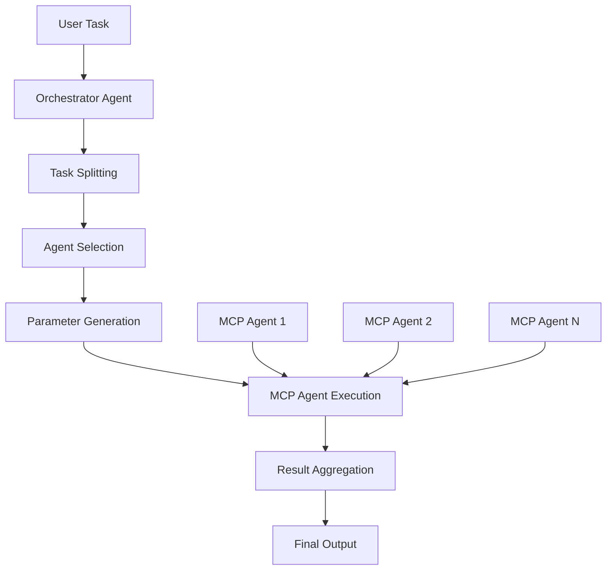

# Nexagen - Next-Generation Multi-Agent System Builder

<div align="center">


[](https://badge.fury.io/py/nexagen)
[](https://www.python.org/downloads/)
[](https://opensource.org/licenses/MIT)
[](https://github.com/taoxiang-org/nexagen/stargazers)

**Build sophisticated multi-agent systems effortlessly with MCP protocol integration**

[🚀 Quick Start](#quick-start) • [📚 Documentation](#documentation) • [🎯 Examples](#examples) • [🤝 Contributing](#contributing)

</div>

---

## 🌟 What is Nexagen?

Nexagen (Next-Generation Agent) is a revolutionary framework that simplifies the creation of multi-agent systems by leveraging the **Model Context Protocol (MCP)**. Instead of manually orchestrating complex agent interactions, Nexagen automatically handles agent scheduling, communication, and coordination.

### ✨ Key Features

- 🔧 **MCP-Based Architecture**: Build agents using standardized MCP protocol
- 🤖 **Automatic Agent Discovery**: Auto-detect and integrate MCP agents
- 🎯 **Intelligent Orchestration**: Multi-level task scheduling and agent coordination  
- 📋 **Industry Compatible**: Generate standard agent cards
- 🚀 **Zero-Configuration**: Focus on individual agents, not system complexity
- 🌐 **Scalable Design**: From single agents to complex multi-agent networks
- 🪄 **Magic MCP Wrapping**: One command to wrap your entire multi-agent system as a single MCP agent for Claude Desktop
- 🎨 **Enhanced Stability**: Robust JSON handling with zero parsing errors (v1.2.3+)

## 🆕 Latest Updates

### Version 1.2.3

**Key Improvements:**

1. **Forced JSON Mode**
   - All LLM calls now use `response_format: {"type": "json_object"}`
   - Ensures strict JSON-only output from language models

2. **Log Isolation**
   - All debug information redirected to `orchestrator.log`
   - Claude Desktop no longer sees internal logging
   - Clean execution process visible to users

3. **Stricter Prompts**
   - Explicit prohibition of explanatory text
   - Clear JSON-only output requirements
   - Reduced ambiguity in LLM responses

4. **Optimized Information Flow**
   - Simplified tool information sent to LLM
   - Reduced response complexity
   - Higher parsing success rate

5. **Reduced Temperature**
   - Lowered from 0.2 to 0.1 for more deterministic output
   - Improved stability over creativity for parameter generation

6. **Retry Mechanism**
   - Automatic retry on parsing failures
   - Graceful degradation without exposing errors to users

**Result:** Users now experience clean, professional execution in Claude Desktop with zero JSON error messages.

## 🏗️ Architecture Overview



### Claude Desktop Integration

```
Claude Desktop → Nexagen MCP Agent → Orchestrator → Internal Agents
```

This architecture enables:
1. Building complex multi-agent systems locally
2. Wrapping them as a single MCP agent with one command
3. Using them in Claude Desktop immediately
4. Getting intelligent task routing automatically

## 🚀 Quick Start

### Installation

```bash
pip install nexagen
```

### Create Your First Multi-Agent System

#### 1. Initialize a new project
```bash
nexagen create my_agent_system
cd my_agent_system
```

#### 2. Configure environment variables
```bash
# Edit .env file
BASE_URL=https://api.your-llm-provider.com
API_KEY=your-api-key-here
model_name=your-model-name
```

#### 3. Develop your MCP agents
Create individual agents in the `mcp_agents/` directory. Each agent should be a separate folder with its MCP implementation.

Example minimal MCP agent:

```python
# server.py
from mcp.server.fastmcp import FastMCP

mcp = FastMCP("Chart Agent")

@mcp.tool()
def draw_chart(data: list, title: str = "Chart") -> str:
    """Generate a chart from data array"""
    # Your chart generation logic here
    return f"chart_{title}.png"

if __name__ == "__main__":
    mcp.run()
```

#### 4. Configure MCP agents
Edit `mcp.json` to register your agents:
```json
{
  "mcpServers": {
    "chart": {
      "command": "uv",
      "args": [
        "--directory", "/path/to/your/chart-agent",
        "run", "server.py"
      ]
    },
    "data_processor": {
      "command": "python",
      "args": ["/path/to/your/data-agent/main.py"]
    }
  }
}
```

#### 5. Build the multi-agent system
```bash
nexagen build
```

This generates:
- `orchestrator_agent.py` - Intelligent task coordinator with enhanced JSON stability
- `mcp_client.py` - MCP communication handler
- `agent_executor.py` - Individual agent task executor
- `pipeline.py` - End-to-end task processing
- `agent_cards/` - Standardized agent metadata
- `mcp_agents/mcp_cards.json` - Detailed capability information

#### 6. Run and test
```bash
nexagen run
```

### 🪄 Magic Wrap as MCP Agent

The **magic** command automatically wraps your entire multi-agent system as a single MCP agent for Claude Desktop integration:

```bash
# After building your multi-agent system
nexagen magic
```

This generates:
- ✨ `mcp_server.py` - Complete MCP server wrapping all your agents
- 📦 `pyproject.toml` - All dependencies configured
- 🎯 All internal agent tools exposed with intelligent routing
- 📖 `NEXAGEN_MCP_USAGE.md` - Detailed usage instructions

**Add to Claude Desktop:**
```json
{
  "mcpServers": {
    "nexagen": {
      "command": "uv",
      "args": [
        "--directory",
        "/path/to/your/project",
        "run",
        "mcp_server.py"
      ]
    }
  }
}
```

**Use in Claude:**
```
"Please use nexagen to analyze Q1 sales data [120, 132, 101, 134, 90, 230] 
and create a visualization chart"
```

Claude automatically calls the `nexagen_route` tool, which:
1. Splits your task into subtasks
2. Selects the right agents
3. Generates parameters
4. Executes and aggregates results

All internal agent tools are also directly accessible with namespace prefixes (e.g., `chart_draw_chart`)!

## 📁 Project Structure

```
my_agent_system/
├── mcp_agents/              # Your individual MCP agents
│   ├── chart_agent/
│   ├── data_agent/
│   └── mcp_cards.json       # Auto-generated agent details
├── agent_cards/             # Nexagen-compatible agent cards
├── .env                     # Environment configuration
├── mcp.json                 # MCP server configuration
├── orchestrator_agent.py    # Auto-generated orchestrator (v1.2.3+)
├── orchestrator.log         # Runtime debug logs (v1.2.3+)
├── mcp_client.py            # Auto-generated MCP client
├── agent_executor.py        # Auto-generated executor
├── pipeline.py              # Auto-generated pipeline
├── test_demo.py             # Auto-generated demo
├── mcp_server.py            # Generated by 'nexagen magic'
├── pyproject.toml           # Generated by 'nexagen magic'
└── NEXAGEN_MCP_USAGE.md     # Generated by 'nexagen magic'
```

## 🎯 Examples

### Example 1: Chart Generation System

```python
# After building your system with chart agents
from pipeline import agent_pipeline

# The orchestrator automatically handles:
# 1. Task analysis
# 2. Agent selection  
# 3. Parameter generation
# 4. Execution coordination

result = agent_pipeline(
    "Create two line charts: "
    "Jan: 89, Feb: 98, Mar: 56. "
    "Second chart: 90, 90, 90"
)
print(result)
```

### Example 2: Multi-Modal Data Processing

```python
# With multiple agents (chart, data, file processors)
result = agent_pipeline(
    "Process the sales data from Q1, "
    "calculate growth rates, and "
    "create visualization charts"
)
```

### Example 3: Claude Desktop Integration

After running `nexagen magic` and configuring Claude Desktop:

```
User: "Analyze this sales data and create visualizations: 
      Q1: 120K, Q2: 135K, Q3: 142K, Q4: 158K"

Claude: [Uses nexagen_route automatically]
        ✅ Task split into subtasks
        ✅ Data analysis agent selected
        ✅ Chart generation agent selected
        ✅ Results aggregated
        
Output: "Analysis complete! Growth rate is 31.7% YoY. 
        Charts saved to: sales_trend_2024.png"
```

## 🔧 Advanced Configuration

### Custom Agent Cards

Nexagen automatically generates compatible agent cards, but you can customize them:

```json
{
  "name": "Chart Agent",
  "description": "Handles chart-related operations",
  "url": "http://localhost:3000/",
  "version": "1.0.0",
  "capabilities": {
    "streaming": false,
    "pushNotifications": false,
    "stateTransitionHistory": false
  },
  "skills": [
    {
      "id": "draw_chart",
      "name": "draw_chart", 
      "description": "Generate charts from data arrays",
      "tags": ["visualization", "charts"],
      "examples": []
    }
  ]
}
```

### Custom Orchestration Logic

The auto-generated `orchestrator_agent.py` can be modified to implement custom task splitting and agent selection logic. Version 1.2.3+ includes enhanced JSON handling:

```python
# Key configurations in orchestrator_agent.py
class OrchestratorAgent:
    def __init__(self):
        # Logging to file instead of console
        logging.basicConfig(
            filename='orchestrator.log',
            level=logging.DEBUG
        )
        
        # LLM configuration with strict JSON mode
        self.llm_config = {
            "temperature": 0.1,  # Low temperature for stability
            "response_format": {"type": "json_object"}  # Force JSON
        }
```

### Debugging

View detailed logs without affecting Claude Desktop experience:

```bash
# Monitor orchestrator operations
tail -f orchestrator.log

# Clear logs when needed
rm orchestrator.log
```

## 📊 System Components

| Component | Purpose | Auto-Generated | Version |
|-----------|---------|----------------|---------|
| **Orchestrator Agent** | Task planning and agent selection | ✅ | Enhanced in v1.2.3 |
| **MCP Client** | Communication with MCP agents | ✅ | All versions |
| **Agent Executor** | Execute individual agent tasks | ✅ | All versions |
| **Pipeline** | End-to-end task processing | ✅ | All versions |
| **Agent Cards** | Compatible agent metadata | ✅ | All versions |
| **MCP Cards** | Detailed agent capability info | ✅ | All versions |
| **MCP Server** | Claude Desktop integration | ✅ | v1.1.0+ (magic command) |
| **Debug Logs** | Runtime diagnostics | ✅ | v1.2.3+ |

## 🤖 How It Works

### 1. Agent Discovery
Nexagen scans your MCP configuration and connects to each agent to discover their capabilities.

### 2. Card Generation
Creates both detailed MCP cards and standardized agent cards for compatibility.

### 3. Orchestration Setup
Builds an intelligent orchestrator that can:
- Split complex tasks into subtasks
- Select appropriate agents for each subtask  
- Generate proper parameters for agent calls
- Coordinate execution and aggregate results
- Handle LLM communication with strict JSON validation (v1.2.3+)

### 4. Pipeline Creation
Generates a unified pipeline interface for seamless multi-agent coordination.

### 5. MCP Wrapping (Optional)
The `nexagen magic` command wraps everything into a single MCP server for Claude Desktop integration.

### 6. Enhanced Error Handling (v1.2.3+)
- All LLM calls use forced JSON mode
- Debug logs isolated from Claude Desktop
- Automatic retry mechanism for robustness
- Simplified information flow to reduce parsing errors

## 🌍 Use Cases

- **Data Processing Pipelines**: Combine data extraction, transformation, and visualization agents
- **Content Generation**: Orchestrate text, image, and multimedia generation agents  
- **Business Automation**: Chain together agents for complex workflow automation
- **Research Systems**: Coordinate agents for data collection, analysis, and reporting
- **Creative Workflows**: Combine agents for design, writing, and multimedia creation
- **Claude Desktop Extensions**: Build sophisticated AI assistants with specialized capabilities

## 📚 Documentation

### CLI Reference

- `nexagen create <project_name>` - Initialize a new multi-agent project
- `nexagen build` - Build the multi-agent system from MCP configuration
- `nexagen run` - Execute the test demo
- `nexagen magic` - Wrap the entire multi-agent system as a single MCP agent

### Configuration Files

- `.env` - Environment variables (API keys, model configuration)
- `mcp.json` - MCP server definitions and connection parameters
- `agent_cards/` - Compatible agent metadata
- `mcp_agents/mcp_cards.json` - Detailed agent capabilities
- `orchestrator.log` - Runtime debug information (v1.2.3+)

### Upgrade Guide

#### To Version 1.2.3

```bash
cd your_project
nexagen build  # Regenerate orchestrator_agent.py with enhanced JSON handling
```

Verify the fix:
1. Restart your MCP Server
2. Execute any task in Claude Desktop
3. Observe the clean execution without JSON errors
4. Check `orchestrator.log` for detailed debugging if needed

## 🤝 Contributing

We welcome contributions! Here's how you can help:

1. **Fork** the repository
2. **Create** a feature branch (`git checkout -b feature/amazing-feature`)
3. **Commit** your changes (`git commit -m 'Add amazing feature'`)
4. **Push** to the branch (`git push origin feature/amazing-feature`)
5. **Open** a Pull Request

### Development Setup

```bash
git clone https://github.com/taoxiang-org/nexagen.git
cd nexagen
pip install -e .
```

## 🔒 Requirements

### System Requirements
- Python 3.8 or higher
- pip or uv package manager
- LLM API access (OpenAI-compatible)

### LLM Requirements (v1.2.3+)
- API must support `response_format` parameter
- JSON mode capability required
- OpenAI API and compatible services supported

### Optional Requirements
- Claude Desktop (for MCP integration)
- UV package manager (recommended for faster dependency management)

## ⚠️ Important Notes

### Version 1.2.3+ Considerations

1. **Log Files**
   - Location: `orchestrator.log` in project root
   - Level: DEBUG (includes all information)
   - Will grow over time - clean periodically

2. **LLM API Compatibility**
   - Forced JSON mode now required
   - Ensure your LLM service supports `response_format`
   - All OpenAI API-compatible services supported

3. **Temperature Setting**
   - Reduced to 0.1 for improved stability
   - May slightly reduce creativity
   - Optimal for parameter generation tasks

4. **Error Visibility**
   - JSON parsing errors no longer shown in Claude Desktop
   - All debug information in `orchestrator.log`
   - Cleaner user experience

## 📄 License

This project is licensed under the MIT License - see the [LICENSE](LICENSE) file for details.

## 🏢 About

Nexagen is developed by **Chongqing Taoxiang Network Technology Co., Ltd.**

- 🌐 Website: [www.taoxiang.org](https://www.taoxiang.org)
- 📧 Contact: [contact@taoxiang.org](mailto:contact@taoxiang.org)
- 🐙 GitHub: [github.com/taoxiang-org](https://github.com/taoxiang-org)

## 🚀 Roadmap

- [x] MCP protocol integration
- [x] Automatic agent discovery
- [x] Magic command for Claude Desktop integration (v1.1.0)
- [x] Enhanced JSON stability (v1.2.3)
- [ ] GUI interface for visual agent orchestration
- [ ] Advanced agent templates and examples
- [ ] Cloud deployment support
- [ ] Performance monitoring and analytics
- [ ] Integration with popular AI frameworks

## 📊 Version History

| Version | Release Date | Key Features |
|---------|-------------|--------------|
| 1.2.3 | Latest | Complete JSON error elimination, enhanced logging |
| 1.2.2 | - | Improved task execution |
| 1.2.1 | - | Bug fixes |
| 1.2.0 | - | Stability improvements |
| 1.1.0 | - | Magic command for MCP wrapping |
| 1.0.0 | - | Initial release |

---

<div align="center">

**⭐ Star this project if it helps you build better multi-agent systems!**

[Report Bug](https://github.com/taoxiang-org/nexagen/issues) • [Request Feature](https://github.com/taoxiang-org/nexagen/issues) • [Join Community](https://github.com/taoxiang-org/nexagen/discussions)

</div>