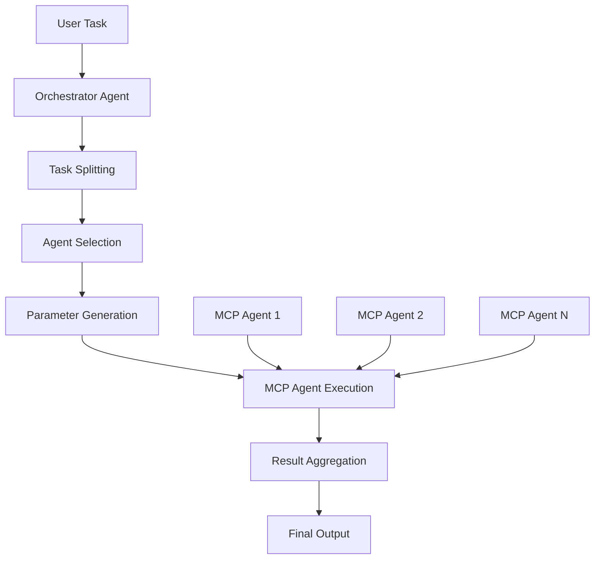

# Nexagen - Next-Generation Multi-Agent System Builder

<div align="center">


[](https://badge.fury.io/py/nexagen)
[](https://www.python.org/downloads/)
[](https://opensource.org/licenses/MIT)
[](https://github.com/taoxiang-org/nexagen/stargazers)

**Build sophisticated multi-agent systems effortlessly with MCP protocol integration**

[🚀 Quick Start](#quick-start) • [📚 Documentation](#documentation) • [🎯 Examples](#examples) • [🤝 Contributing](#contributing)

</div>

---

## 🌟 What is Nexagen?

Nexagen (Next-Generation Agent) is a revolutionary framework that simplifies the creation of multi-agent systems by leveraging the **Model Context Protocol (MCP)**. Instead of manually orchestrating complex agent interactions, Nexagen automatically handles agent scheduling, communication, and coordination.

### ✨ Key Features

- 🔧 **MCP-Based Architecture**: Build agents using standardized MCP protocol
- 🤖 **Automatic Agent Discovery**: Auto-detect and integrate MCP agents
- 🎯 **Intelligent Orchestration**: Multi-level task scheduling and agent coordination  
- 📋 **Industry Compatible**: Generate standard agent cards
- 🚀 **Zero-Configuration**: Focus on individual agents, not system complexity
- 🌐 **Scalable Design**: From single agents to complex multi-agent networks

## 🏗️ Architecture Overview



## 🚀 Quick Start

### Installation

```bash
pip install nexagen
```

### Create Your First Multi-Agent System

1. **Initialize a new project**
```bash
nexagen create my_agent_system
cd my_agent_system
```

2. **Configure environment variables**
```bash
# Edit .env file
BASE_URL=https://api.your-llm-provider.com
API_KEY=your-api-key-here
model_name=your-model-name
```

3. **Develop your MCP agents**
Create individual agents in the `mcp_agents/` directory. Each agent should be a separate folder with its MCP implementation.

4. **Configure MCP agents**
Edit `mcp.json` to register your agents:
```json
{
  "mcpServers": {
    "chart": {
      "command": "uv",
      "args": [
        "--directory", "/path/to/your/chart-agent",
        "run", "server.py"
      ]
    },
    "data_processor": {
      "command": "python",
      "args": ["/path/to/your/data-agent/main.py"]
    }
  }
}
```

5. **Build the multi-agent system**
```bash
nexagen build
```

6. **Run and test**
```bash
nexagen run
```

## 📁 Project Structure

After initialization, your project will have this structure:

```
my_agent_system/
├── mcp_agents/           # Your individual MCP agents
│   ├── chart_agent/
│   ├── data_agent/
│   └── mcp_cards.json    # Auto-generated agent details
├── agent_cards/          # Nexagen-compatible agent cards
├── .env                  # Environment configuration
├── mcp.json             # MCP server configuration
├── orchestrator_agent.py # Auto-generated orchestrator
├── mcp_client.py        # Auto-generated MCP client
├── agent_executor.py    # Auto-generated executor
├── pipeline.py          # Auto-generated pipeline
└── test_demo.py         # Auto-generated demo
```

## 🎯 Examples

### Example 1: Chart Generation System

```python
# After building your system with chart agents
from pipeline import agent_pipeline

# The orchestrator automatically handles:
# 1. Task analysis
# 2. Agent selection  
# 3. Parameter generation
# 4. Execution coordination

result = agent_pipeline(
    "Create two line charts: "
    "Jan: 89, Feb: 98, Mar: 56. "
    "Second chart: 90, 90, 90"
)
print(result)
```

### Example 2: Multi-Modal Data Processing

```python
# With multiple agents (chart, data, file processors)
result = agent_pipeline(
    "Process the sales data from Q1, "
    "calculate growth rates, and "
    "create visualization charts"
)
```

## 🔧 Advanced Configuration

### Custom Agent Cards

Nexagen automatically generates compatible agent cards, but you can customize them:

```json
{
  "name": "Chart Agent",
  "description": "Handles chart-related operations",
  "url": "http://localhost:3000/",
  "version": "1.0.0",
  "capabilities": {
    "streaming": false,
    "pushNotifications": false,
    "stateTransitionHistory": false
  },
  "skills": [
    {
      "id": "draw_chart",
      "name": "draw_chart", 
      "description": "Generate charts from data arrays",
      "tags": ["visualization", "charts"],
      "examples": []
    }
  ]
}
```

### Custom Orchestration Logic

The auto-generated `orchestrator_agent.py` can be modified to implement custom task splitting and agent selection logic.

## 🛠️ Development

### Building Individual MCP Agents

Each agent should implement the MCP protocol. Here's a minimal example:

```python
# server.py
from mcp.server.fastmcp import FastMCP

mcp = FastMCP("Chart Agent")

@mcp.tool()
def draw_chart(data: list, title: str = "Chart") -> str:
    """Generate a chart from data array"""
    # Your chart generation logic here
    return f"chart_{title}.png"

if __name__ == "__main__":
    mcp.run()
```

### Testing Your Agents

Nexagen provides automatic testing capabilities:

```bash
# Test individual agent
python auto_find_mcp_agents.py

# Test full system
nexagen run
```

## 📊 System Components

| Component | Purpose | Auto-Generated |
|-----------|---------|----------------|
| **Orchestrator Agent** | Task planning and agent selection | ✅ |
| **MCP Client** | Communication with MCP agents | ✅ |
| **Agent Executor** | Execute individual agent tasks | ✅ |
| **Pipeline** | End-to-end task processing | ✅ |
| **Agent Cards** | Compatible agent metadata | ✅ |
| **MCP Cards** | Detailed agent capability info | ✅ |

## 🤖 How It Works

1. **Agent Discovery**: Nexagen scans your MCP configuration and connects to each agent to discover their capabilities

2. **Card Generation**: Creates both detailed MCP cards and standardized agent cards

3. **Orchestration Setup**: Builds an intelligent orchestrator that can:
   - Split complex tasks into subtasks
   - Select appropriate agents for each subtask  
   - Generate proper parameters for agent calls
   - Coordinate execution and aggregate results

4. **Pipeline Creation**: Generates a unified pipeline interface for seamless multi-agent coordination

## 🌍 Use Cases

- **Data Processing Pipelines**: Combine data extraction, transformation, and visualization agents
- **Content Generation**: Orchestrate text, image, and multimedia generation agents  
- **Business Automation**: Chain together agents for complex workflow automation
- **Research Systems**: Coordinate agents for data collection, analysis, and reporting
- **Creative Workflows**: Combine agents for design, writing, and multimedia creation

## 📚 Documentation

### CLI Reference

- `nexagen create <project_name>` - Initialize a new multi-agent project
- `nexagen build` - Build the multi-agent system from MCP configuration
- `nexagen run` - Execute the test demo

### Configuration

- `.env` - Environment variables (API keys, model configuration)
- `mcp.json` - MCP server definitions and connection parameters
- `agent_cards/` - Compatible agent metadata
- `mcp_agents/mcp_cards.json` - Detailed agent capabilities

## 🤝 Contributing

We welcome contributions! Here's how you can help:

1. **Fork** the repository
2. **Create** a feature branch (`git checkout -b feature/amazing-feature`)
3. **Commit** your changes (`git commit -m 'Add amazing feature'`)
4. **Push** to the branch (`git push origin feature/amazing-feature`)
5. **Open** a Pull Request

### Development Setup

```bash
git clone https://github.com/taoxiang-org/nexagen.git
cd nexagen
pip install -e .
```

## 📄 License

This project is licensed under the MIT License - see the [LICENSE](LICENSE) file for details.

## 🏢 About

Nexagen is developed by **Chongqing Taoxiang Network Technology Co., Ltd.**

- 🌐 Website: [www.taoxiang.org](https://www.taoxiang.org)
- 📧 Contact: [contact@taoxiang.org](mailto:contact@taoxiang.org)
- 🐙 GitHub: [github.com/taoxiang-org](https://github.com/taoxiang-org)

## 🚀 What's Next?

- [ ] GUI interface for visual agent orchestration
- [ ] Advanced agent templates and examples
- [ ] Cloud deployment support
- [ ] Performance monitoring and analytics
- [ ] Integration with popular AI frameworks

---

<div align="center">

**⭐ Star this project if it helps you build better multi-agent systems!**

[Report Bug](https://github.com/taoxiang-org/nexagen/issues) • [Request Feature](https://github.com/taoxiang-org/nexagen/issues) • [Join Community](https://github.com/taoxiang-org/nexagen/discussions)

</div>